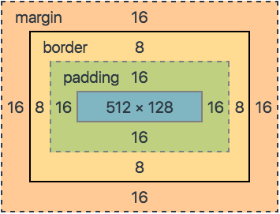
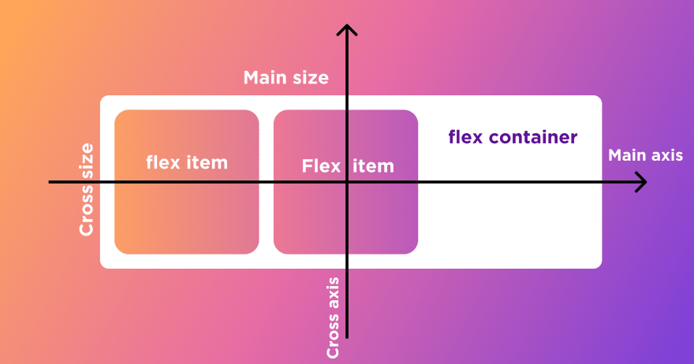

## CSS

### BOX model 구성

- 모든 요소는 박스모델이고, 왼쪽에서 오른쪽으로, 위에서부터 아래로 쌓인다. (normal flow)
- 하나의 박스는 네 부분(영역)으로 이루어진다.
   - content : 글이나 이미지 등 요소의 실제 내용
   - padding : 테두리 안쪽의 내부 여백. 요소에 적용된 배경색, 이미지는 padding 까지 적용된다.
   - border : 테두리 영역
   - margin : 테두리 바깥의 외부 여백. 배경색을 지정할 수 없다.
  
      

- shorthand
    ```
    .mar {
        margin: 10px 20px 30px 40px;
    } /* 상 - 우 - 하 - 좌 */
    ```
    ```
    .mar {
        margin: 10px
    } /* 상하좌우 전부 */
    ```
    ```
    .mar {
        margin: 10px 20px
    } /* 상하 - 좌우 */
    ```
    ```
    .mar {
        margin: 10px 20px 30px
    } /* 상 - 좌우 - 하 */
    ```

- Box Sizing
  - 기본적으로 모든 요소의 box-sizing은 content-box을 기준으로 한다.
  - 만약 border까지의 너비를 보는 것을 원한다면 box-sizing을 border-box로 설정하면 된다.

### CSS display

- 모든 요소는 박스모델이고, display에 따라 크기와 배치가 달라진다.
- inline / block 요소
  - inline
    - 줄바꿈이 일어나지 않는 행의 일부 요소
    - contents 만큼만 영역을 차지한다.
    - width, height,margin을 지정할 수 없다.
    - 상하 여백은 line-height로 지정한다.
    - ex_ div / ul, ol, li / p / hr / form ...
  - block
    - 화면 크기 전체의 가로 폭을 차지한다.(100%)
    - 전체 너비를 가질 수 없다면 자동으로 margin 부여된다.
    - 줄바꿈이 일어나는 요소
    - 블록 요소 안에 인라인 요소가 들어갈 수 있다.
    - ex_ span / a / img / input, label / b, em, i, strong ...
  - inline-block
    - inline이 할 수 없었던 margin, width 등의 속성 값을 적용시킬 수 있게 만들어주는 속성

- 속성에 따른 수평 정렬
    ```
    ```


- 
    `display: none`
    - 해당 요소를 화면에 표시하지 않고, 공간조차 부여되지 않는다.
    - 비슷한 ``visibility: hidden``은 해당 요소가 공간은 차지하나 화면에 표시만 하지 않는다.

### CSS position

- 문서 상에서 요소의 위치를 지정(어떤 기준으로 어디에 배치시킬지)
- `static` : 모든 태그의 기본 값(기준 위치)
  - 일반적인 요소의 배치 순서에 따름(좌측 상단)
  - 부모 요소 내에서 배치될 때는 부모 요소의 위치를 기준으로 배치 됨
- 다음 요소들은 좌표 프로퍼티 `top, bottom, left, right` 를 사용하여 이동 가능
- `relative` : 상대 위치
  - 자기 자신의 static 위치를 기준으로 이동(normal flow 유지)
  - 레이아웃에서 요소가 차지하는 공간은 static일때와 같다.(normal position 대비 offset)
- `absolute` : 절대 위치
  - normal flow에서 벗어남
  - 레이아웃에 공간을 차지하지 않음
  - 가장 가까이 있는 부모/조상 요소 중 static이 아닌 요소를 기준으로 이동(없는 경우엔 body기준)
- `fixed` : 고정 위치
  - normal flow에서 벗어남
  - 레이아웃에 공간을 차지하지 않음
  - 부모 요소와 관계없이 viewport를 기준으로 이동
    - 스크롤 시에도 항상 같은 곳에 위치함
- `sticky` : 스크롤에 따라 static -> fixed 로 변경
  - 스크롤 위치가 임계점에 이르면 position : fixed 와 같이 박스를 화면에 고정할 수 있는 속성
  
### CSS layout

- Float
  - 박스를 왼쪽 혹은 오른쪽으로 이동시켜 텍스트를 포함, 인라인 요소들이 주변을 wrapping 하도록 하는 것
  - 요소가 Normal flow를 벗어나도록 함
  - 속성
    - none: 기본값
    - left: 요소를 왼쪽으로 띄움
    - right: 요소를 오른쪽으로 띄움
  - 최근엔 `flexbox` , `grid` 등장으로 사용도가 낮아짐
  - Normal flow에서 벗어난 레이아웃을 구성할 때 활용

### Flexbox  `중요해서 따로 뺌!`

- 수동 값 부여 없이
  1. 수직정렬
  2. 아이템의 너비와 높이 혹은 간격을 동일하게 배치 하고 싶다!
- 행과 열 형태로 아이템들을 배치하는 1차원 레이아웃 모델
- 축
  - main axis(메인 축)
  - cross axis(교차 축)
    
- 구성요소
  - flex container(부모 요소)
    - display : flex 혹은 inline-flex 로 지정
  - flex item(자식 요소) 
- flex-direction : row
  - 아이템이 쌓이는 방향이 메인
- 속성
  - `배치 설정`
  1. flex-direction
     - row
     - column
     - -reverse
  2. flex-wrap (컨테이너를 벗어나면 어떻게 배치할건지 ?)
     - wrap
     - nowrap 
  - `공간 나누기`
  1. justify-content (main axis 기준)
       - flex-start/end  
       - center
       - space-between/around/evenly
   2. align-content (cross axis 기준)
       - flex-start/end
       - center
       - space-between/around/evenly
  - `정렬`
   1. align-items (cross axis 기준)
      - stretch
      - flex-start/end
      - center
      - baseline
   2. align-self (개별 아이템)
      - stretch
      - flex-start/end
      - center
      - baseline
  - `기타속성`
  1. flex-grow : 남은 영역을 아이템에 분배
  2. order : 배치 순서
  
