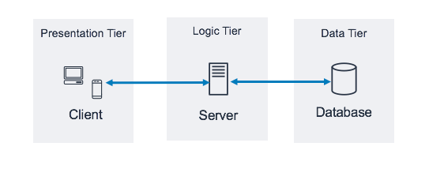
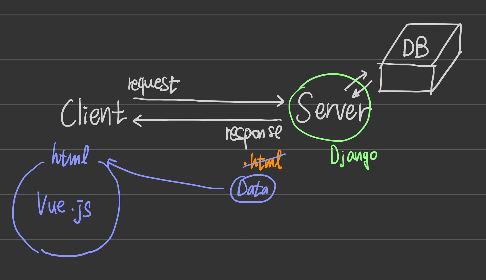
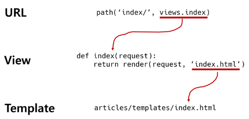

# Django

### Framework

- 많은 개발자들이 수없이 개발해보고, 그 과정에서 자주 사용되는 부분들을 재사용 할 수 있게 좋은 구조의 코드로 만들어 두었다.
- 그러한 코드들을 모아놓은 것, 즉 서비스 개발에 필요한 기능들을 미리 구현해서 모아놓은 것을 프레임워크 라고 한다.
- 개발속도 증가, 검증된 코드, 효율성 증가, 협업 용이, 생산성&품질 상승
- 선택의 폭 좁아짐, 러닝커브(학습곡선)존재
- Frame(뼈대, 틀) + Work(일하다)
- `소프트웨어 프레임워크` 는 복잡한 문제를 해결하거나 서술하는데 사용되는 기본 개념 구조

### 클라이언트-서버 구조

- 클라이언트
  - 웹 사용자의 인터넷에 연결된 장치
  - Chrome 또는 Firefox와 같은 웹 브라우저
  - 서비스(resorce)를 요청(request)하는 주체
- 서버
  - 클라이언트가 웹 페이지에 접근하려고 할 때 서버에서 클라이언트 컴퓨터로 웹 페이지 데이터를 응답해 사용자의 웹 브라우저에 표시됨
  - 요청에 대해 서비스를 응답하는 주체(server)

### 가상환경

> 가상환경을 설정하지 않고 pip install -을 하면 전역에 설치가 된다.
> 전부 전역에 설치되면 각 프로젝트에 필요한 모듈을 알 수 없기 때문에 업무를 할 때 혼란이 올 수 있다.
> 때문에 가상환경을 만들어 모듈을 설치하면 각 프로젝트에 필요한 모듈을 확인 가능하다.
> 다만 git에 프로젝트를 올린 뒤 다른 컴퓨터로 가면 작동이 안되기 때문에 pip freeze > requirement.txt 를 해서 같이 git push 하면 어떤 모듈을 사용하고, 뭘 설치해야하는지 다른 사람들도 알 수 있다.

- 가상환경 생성 : python -m venv venv
- 활성화 : source venv/Scripts/activate
- 비활성화 : deactivate
- 가상환경 패키지 목록 저장 : pip freeze > requirements.txt
- 파일로부터 패키지 설치 : pip install -r requirements.txt

### django 설치

- pip install django
- django-admin startproject (폴더명) .(실행된 폴더 바로 아래에 설치하고 싶다면 . 붙이기)
- python manage.py runserver

 

- 프로젝트 구조
  - 하나의 서비스
  - django-admin startproject (폴더명) .(실행된 폴더 바로 아래에 설치하고 싶다면 . 붙이기)
  - <----->
  - __init__.py
  - asgi.py
  - settings.py : 프로젝트 설정을 관리
  - urls.py : 사이트의 url과 views의 연결을 지정 (path를 처리하는 곳, 클라이언트가 요청)
  - wsgi.py
  - manage.py : 상호작용 하는 커맨드 라인 유틸리티
    - python manage.py <command> [options]
  
- App 구조
  - 프로젝트 안에 기능단위의 여러 App을 생성할 수 있음
  - python manage.py startapp 앱 이름(웬만하면 복수형 권장)
  - <----->
  - __init__.py
  - admin.py : 관리자용 페이지를 설정하는 곳
  - apps.py
  - models.py : 애플리케이션에서 사용하는 Model을 정의하는 곳. MTV패턴의 M에 해당
  - tests.py
  - views.py : view 함수들이 정의되는 곳. MTV패턴의 V에 해당
  
- 애플리케이션 등록 ✨✨✨
  - setting.py -> installed_apps 에 'articles' 추가해야 함

### Django의 세가지 구조

- Model (Data)
- View (logic)
- Template (보여지는 것)

### 요청과 응답

`URL -> VIEW -> TEMPLATE`

- URL
  - path('문서이름/', 실행할 함수명)
- VIEW
  - url에서 적어줬던 함수명으로 함수 만들기
  - request를 인자로 갖음
  - return render() 해주면 그 파일을 열어줌
- render()
  - `render(request, template_name, context)`
  - html 파일을 클라이언트에게 제공(서비스)하고자 할 때 사용
  1. request
  2. template_name
     1. 경로 : templates안의 'app폴더명/a.html'
  3. context
- templates -> 반드시 오타없이 소문자로 templates라고 적어야 함
  - 위치는 app폴더 안 (중요) views.py와 같은 라인
  - 이 폴더 안에 app폴더와 이름 동일하게 폴더 하나 더 생성한 뒤, 그 안에 .html 파일 생성

`흐름!!!`
